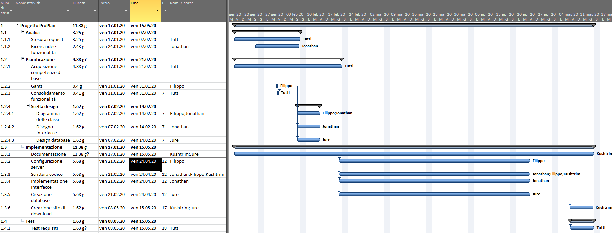
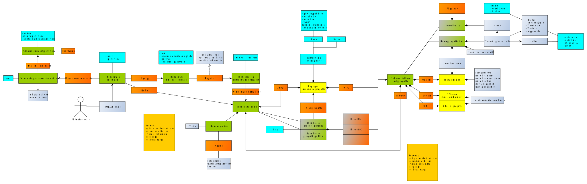
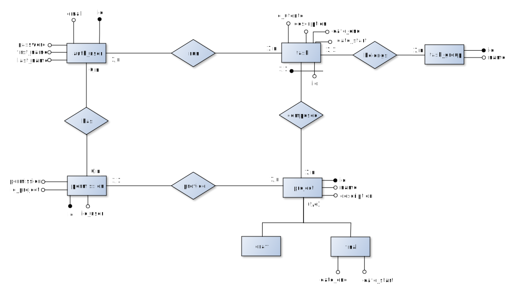

1. [Introduzione](#introduzione)
  - [Informazioni sul progetto](#informazioni-sul-progetto)
  - [Abstract](#abstract)
  - [Scopo](#scopo)
1. [Analisi](#analisi)
  - [Analisi del dominio](#analisi-del-dominio)
  - [Analisi dei mezzi](#analisi-dei-mezzi)
  - [Analisi e specifica dei requisiti](#analisi-e-specifica-dei-requisiti)
  - [Use case](#use-case)
  - [Pianificazione](#pianificazione)
1. [Progettazione](#progettazione)
  - [Design dell’architettura del sistema](#design-dell’architettura-del-sistema)
  - [Design dei dati e database](#design-dei-dati-e-database)
1. [Implementazione](#implementazione)
1. [Test](#test)
  - [Protocollo di test](#protocollo-di-test)
  - [Risultati test](#risultati-test)
  - [Mancanze/limitazioni conosciute](#mancanze/limitazioni-conosciute)
1. [Consuntivo](#consuntivo)
1. [Conclusioni](#conclusioni)
  - [Sviluppi futuri](#sviluppi-futuri)
  - [Considerazioni personali](#considerazioni-personali)
1. [Sitografia](#sitografia)
1. [Allegati](#allegati)

## Introduzione
### Informazioni sul progetto
**Nome: ProPlan**
- Allievi: Kushtrim Rushi, Filippo Zinetti, Jure Grgic, Jonathan Müller
- Docente responsabile al controllo del lavoro: Luca Muggiasca
- Data inizio del progetto: 17 Gennaio 2020
- Data fine del progetto: 15 Maggio 2020
- Luogo di lavoro: Scuola arti e mestieri di Trevano, Canobbio
- Sezione scolastica: 3° anno d'informatica
- Materia dove viene svolto il lavoro: modulo 306

### Abstract
Migliaia sono i progetti che ogni giorno vengono avviati. Hanno diverse dimensioni, diversi scopi e finscono in diversi modi, ma quello che hanno in comune è una delle fasi cruciali, che deve essere svolta all'inizio indipendentemente da tutto: la progettazione.
Questa comprende una scomposizione del lavoro in fasi più piccole e più gestibili da singole persone o team, che devono poi collaborare al meglio per raggiungere un obbiettivo comune. Questo non dovrebbe essere un problema, poichè esistono molte soluzioni per gestire team di persone... quello che manca a questi è **semplicità** e **immediatezza** nel loro utilizzo.
È per questo che abbiamo sviluppato ProPlan, uno strumento che permette di creare e gestire piccoli progetti in modo immediato e senza quindi perdersi in impostazioni e funzionalità superflue.
La piattaforma è sviluppata in python, linguaggio sempre più popolare grazie alla sua semplicità, che rispecchia quindi perfettamente gli ideali del progetto.

<!--
E’ una breve e accurata rappresentazione dei contenuti di un documento,
senza notazioni critiche o valutazioni. Lo scopo di un abstract efficace
dovrebbe essere quello di far conoscere all’utente il contenuto di base
di un documento e metterlo nella condizione di decidere se risponde ai
suoi interessi e se è opportuno il ricorso al documento originale.

Può contenere alcuni o tutti gli elementi seguenti:

-   **Background/Situazione iniziale**

-   **Descrizione del problema e motivazione**: Che problema ho cercato
    di risolvere? Questa sezione dovrebbe includere l'importanza del
    vostro lavoro, la difficoltà dell'area e l'effetto che potrebbe
    avere se portato a termine con successo.

-   **Approccio/Metodi**: Come ho ottenuto dei progressi? Come ho
    risolto il problema (tecniche…)? Quale è stata l’entità del mio
    lavoro? Che fattori importanti controllo, ignoro o misuro?

-   **Risultati**: Quale è la risposta? Quali sono i risultati? Quanto è
    più veloce, più sicuro, più economico o in qualche altro aspetto
    migliore di altri prodotti/soluzioni?

Esempio di abstract:

> *As the size and complexity of today’s most modern computer chips
> increase, new techniques must be developed to effectively design and
> create Very Large Scale Integration chips quickly. For this project, a
> new type of hardware compiler is created. This hardware compiler will
> read a C++ program, and physically design a suitable microprocessor
> intended for running that specific program. With this new and powerful
> compiler, it is possible to design anything from a small adder, to a
> microprocessor with millions of transistors. Designing new computer
> chips, such as the Pentium 4, can require dozens of engineers and
> months of time. With the help of this compiler, a single person could
> design such a large-scale microprocessor in just weeks.*
-->

### Scopo
Il progetto ci è stato assegnato dalla scuola ed è quindi un progetto didattico, ma potrà poi risultare utile anche a coloro che necessiteranno di gestire un progetto di gruppo nei prossimi anni.
L'obbettivo è quello di creare uno strumento simile a quelli già esistenti, ma con meno funzionalità in modo da risultare più semplice per gli utilizzatori. Le soluzioni attuali presentano infatti diversi elementi superflui per il target di ProPlan, di cui anche gli sviluppatori hanno fanno parte, ed è quindi sull'analisi dei bisogni e degli elementi di disturbo che la piattaforma è sviluppata.
L'applicativo sarà reso disponibile tramite pagina web, quindi raggiungibile da ovunque.

<!--
Lo scopo del progetto (scopi didattici/scopi operativi). Dovrebbe
descrivere il mandato, ma non vanno ricopiate le informazioni del
quaderno dei compiti (che va invece allegato).
-->
## Analisi
### Analisi del dominio
ProPlan è progettato per l'uso nell'ambiente scolastico della SAMT, andando a sostituire altri programmi (es: trello, eventualmente Microsoft Project e Project Libre). Il software dovrà risiedere da qualche parte nella rete della scuola o quantomeno accessibile da questa, e dovrà quindi far fronte al proxy che blocca parte delle comunicazioni. Lo sviluppo dovrà avvenire in ambienti locali.
Gli utilizzatori saranno allievi ed eventualmente docenti mandanti della SAMT (scuola arti e mestieri di Trevano), che necessitano rispettivamente di imparare e di valutare la gestione dei progetti.
La conoscenza richiesta, oltre al saper utilizzare un computer per interagire con la pagina vera e propria, è quella di una base delle modalità di gestione di un progetto per poter amministrare l'incarico e un minimo di propensione nel lavoro in team.

<!--
Questo capitolo dovrebbe descrivere il contesto in cui il prodotto verrà
utilizzato, da questa analisi dovrebbero scaturire le risposte a quesiti
quali ad esempio:
-   Background/Situazione iniziale
-   Quale è e come è organizzato il contesto in cui il prodotto dovrà
    funzionare?
-   Come viene risolto attualmente il problema? Esiste già un prodotto
    simile?
-   Chi sono gli utenti? Che bisogni hanno? Come e dove lavorano?
-   Che competenze/conoscenze/cultura posseggono gli utenti in relazione
    con il problema?
-   Esistono convenzioni/standard applicati nel dominio?
-   Che conoscenze teoriche bisogna avere/acquisire per poter operare
    efficacemente nel dominio?
    -->
### Analisi e specifica dei requisiti

<!--
|**ID**            |Req-1                                                                          |
|------------------|-------------------------------------------------------------------------------|
|**Nome**          | Deve essere presente un admin globale                                         |
|**Priorità**      |                                                                               |
|**Versione**      |                                                                               |
|**Note**          |                                                                               |
req-1: Deve essere presente un admin globale
req-2: L'admin globale deve aver il controllo assoluto del sito web
req-3: Ci possono essere degli ospiti per un progetto
req-4: Gli ospiti hanno un permesso di sola lettura in un determinato progetto
req-5: Ogni progetto avrà un capoprogetto
req-6: È possibile nominare un cocapo del progetto
req-7: Possono essere nominati dei membri del progetto
req-8: Ogni membro ha la possibilità di lavorare sul progetto, con qualche piccola restrizione.
req-9: Si deve avere la possibilità di poter creare un bozza di progetto. (Nota: non è un progetto effettivo, ma sarà solo una prova dove poter scrivere le idee iniziali di un progetto)
req-10: Il sito web deve essere realizzato con HTML, CSS, JS e Python
req-11: Dovranno essere specificati dei dettagli del progetto, ovvero, nome del progetto, attività,
lista dei membri, l'inizio e la fine del progetto, descrizione del progetto.
req-12: È necessario che vengano specificati nome, descrizione e durata di un attività
req-
-->

|**ID**|**Nome**        |**Priorità**|**Vers**|**Note**|
|------|----------------|------------|--------|--------|
|Req-01|Realizzare un sito web per la gesitone dei progetti|1|1.0|...|
|Req-02|Il sito web è programmato in python|1|1.0|...|
|Req-03|Ci deve essere una schermata di signup e una di login|1|1.0|...|
|Req-04|Ci deve essere una schermata di password recovery|3|1.0|...|
|Req-05|Ci sono due tipi di utente a livello del login (admin, utente)|1|1.0|...|
|Req-06|Ci deve essere una schermata principale con la lista dei progetti|2|1.0|...|
|Req-07|Si può creare un progetto|1|1.0|...|
|Req-08|Un progetto deve avere dei dettagli (nome, descrizione, lista membri, inizio e fine)|1|1.0|...|
|Req-09|Un progetto può essere una bozza o un progetto finale|1|1.0|...|
|Req-10|Una bozza si può convertire in un progetto finale|2|1.0|...|
|Req-11|Un progetto può essere pubblico o privato (non visibile da non-membri)|1|1.0|...|
|Req-12|Gli utenti hanno ruoli diversi a livello di progetto (capoprogetto, ospite, …)|1|1.0|...|
|Req-13|Nel progetto si possono creare delle attività|1|1.0|...|
|Req-14|Si possono modificare le informazioni di un progetto|2|1.0|...|
|Req-15|Una attività deve avere dei dettagli (nome, descrizione, durata)|1|1.0|...|
|Req-16|Un'attività può essere in determinate sezioni (idea, da fare, in esecuzione, terminato, testato, approvato)|1|1.0|...|
|Req-17|Si possono creare nuove sezioni|1|1.0|...|
|Req-18|Ci deve essere una sezione dove si può reportare i bug|2|1.0|...|
|Req-19|Vanno controllati gli indirizzi email per registrarsi|2|1.0|consentito solo per @samtrevano.ch — @edu.ti.ch|
|Req-20|Ci deve essere un database per il salvataggio dei progetti|1|1.0|...|
|Req-21|Si possono utilizzare le attività di un progetto concluso come nuove attività|4|1.0|!!!|

<!--
**Spiegazione elementi tabella dei requisiti:**
**ID**: identificativo univoco del requisito
**Nome**: breve descrizione del requisito
**Priorità**: indica l’importanza di un requisito nell’insieme del
progetto, definita assieme al committente. Ad esempio poter disporre di
report con colonne di colori diversi ha priorità minore rispetto al
fatto di avere un database con gli elementi al suo interno. Solitamente
si definiscono al massimo di 2-3 livelli di priorità.

**Versione**: indica la versione del requisito. Ogni modifica del
requisito avrà una versione aggiornata.

Sulla documentazione apparirà solamente l’ultima versione, mentre le
vecchie dovranno essere inserite nei diari.

**Note**: eventuali osservazioni importanti o riferimenti ad altri
requisiti.
-->

### Use case

### Pianificazione
Gantt preventivo:

### Analisi dei mezzi
L'applicativo si basa su python, un linguaggio di alto livello disponibile su ogni piattaforma e che si distingue per la sua sintassi severa rispetto all'indentazione, a favore di una scrittura spesso più breve.
Per lo sviluppo è stato utilizzato Web2py, un framework leggero e pensato per creare piccole applicazioni web. Inoltre, integra SQLite, le librerie necessarie per interagirci ed eventualmente la possiblità di espandere il database (passando, per esempio, ad Oracle o mySQL) senza problemi grazie all'alto livello di astrazione.
L'ambiente di sviluppo sarà locale per evitare problemi di rete, quindi l'hardware è rappresentato da computer portatili che integreranno il server grazie a web2py e dei client simulati tramite browser.
La piattaforma di funzionamento è vincolata non a sistemi operativi specifici, quanto più ai browser che andranno a visitare le pagine del sito, i quali dovranno essere abbastanza recenti ed aggiornati da supportare le funzioni del software.

<!--
Elencare e *descrivere* i mezzi disponibili per la realizzazione del
progetto. Ricordarsi di sempre descrivere nel dettaglio le versioni e il
modello di riferimento.
SDK, librerie, tools utilizzati per la realizzazione del progetto e
eventuali dipendenze.
Su quale piattaforma dovrà essere eseguito il prodotto? Che hardware
particolare è coinvolto nel progetto? Che particolarità e limitazioni
presenta? Che hw sarà disponibile durante lo sviluppo?
-->

## Progettazione

<!--
Questo capitolo descrive esaustivamente come deve essere realizzato il
prodotto fin nei suoi dettagli. Una buona progettazione permette
all’esecutore di evitare fraintendimenti e imprecisioni
nell’implementazione del prodotto.
-->

### Design dell’architettura del sistema
**\*da controllare**
Alla creazione di un progetto si possono creare le attività del progetto e si possono definire i permessi di altri utenti, nominando magari un cocapo progetto oppure un semplice membro del progetto.
Si possono creare anche delle bozze di progetti, ovvero non dei veri e propri progetti, ma delle idee per il progetto vero e proprio.

<!--
Descrive:
- La struttura del programma/sistema lo schema di rete...
- Gli oggetti/moduli/componenti che lo compongono.
- I flussi di informazione in ingresso ed in uscita e le
relative elaborazioni. Può utilizzare *diagrammi di flusso dei
dati* (DFD).
- Eventuale sitemap
-->

### Design dei dati e database
Descrizione delle strutture di dati utilizzate dal programma in base
agli attributi e le relazioni degli oggetti in uso.

### Schema E-R, schema logico e descrizione.

<!--
Se il diagramma E-R viene modificato, sulla doc dovrà apparire l’ultima
versione, mentre le vecchie saranno sui diari.
-->

### Design delle interfacce
Descrizione delle interfacce interne ed esterne del sistema e
dell’interfaccia utente. La progettazione delle interfacce è basata
sulle informazioni ricavate durante la fase di analisi e realizzata
tramite mockups.

### Design procedurale
Descrive i concetti dettagliati dell’architettura/sviluppo utilizzando
ad esempio:
-   Diagrammi di flusso e Nassi.
-   Tabelle.
-   Classi e metodi.
-   Tabelle di routing
-   Diritti di accesso a condivisioni …
Questi documenti permetteranno di rappresentare i dettagli procedurali
per la realizzazione del prodotto.

## Implementazione

<!--
In questo capitolo dovrà essere mostrato come è stato realizzato il
lavoro. Questa parte può differenziarsi dalla progettazione in quanto il
risultato ottenuto non per forza può essere come era stato progettato.

Sulla base di queste informazioni il lavoro svolto dovrà essere
riproducibile.

In questa parte è richiesto l’inserimento di codice sorgente/print
screen di maschere solamente per quei passaggi particolarmente
significativi e/o critici.

Inoltre dovranno essere descritte eventuali varianti di soluzione o
scelte di prodotti con motivazione delle scelte.

Non deve apparire nessuna forma di guida d’uso di librerie o di
componenti utilizzati. Eventualmente questa va allegata.

Per eventuali dettagli si possono inserire riferimenti ai diari.
-->

## Test

### Protocollo di test

|Test Case      | TC-00                               |
|---------------|--------------------------------------|
|**Nome**       | |
|**Riferimento**|REQ-00                               |
|**Descrizione**| |
|**Prerequisiti**| |
|**Procedura**     |  |
|**Risultati attesi** | |

|Test Case      | TC-00                               |
|---------------|--------------------------------------|
|**Nome**       | |
|**Riferimento**|REQ-00                               |
|**Descrizione**| |
|**Prerequisiti**| |
|**Procedura**     |  |
|**Risultati attesi** | |

<!--
Definire in modo accurato tutti i test che devono essere realizzati per
garantire l’adempimento delle richieste formulate nei requisiti. I test
fungono da garanzia di qualità del prodotto. Ogni test deve essere
ripetibile alle stesse condizioni.

|Test Case      | TC-001                               |
|---------------|--------------------------------------|
|**Nome**       |Import a card, but not shown with the GUI |
|**Riferimento**|REQ-012                               |
|**Descrizione**|Import a card with KIC, KID and KIK keys with no obfuscation, but not shown with the GUI |
|**Prerequisiti**|Store on local PC: Profile\_1.2.001.xml (appendix n\_n) and Cards\_1.2.001.txt (appendix n\_n) |
|**Procedura**     | - Go to “Cards manager” menu, in main page click “Import Profiles” link, Select the “1.2.001.xml” file, Import the Profile - Go to “Cards manager” menu, in main page click “Import Cards” link, Select the “1.2.001.txt” file, Delete the cards, Select the “1.2.001.txt” file, Import the cards |
|**Risultati attesi** |Keys visible in the DB (OtaCardKey) but not visible in the GUI (Card details) |
-->

### Risultati test

<!--
Tabella riassuntiva in cui si inseriscono i test riusciti e non del
prodotto finale. Se un test non riesce e viene corretto l’errore, questo
dovrà risultare nel documento finale come riuscito (la procedura della
correzione apparirà nel diario), altrimenti dovrà essere descritto
l’errore con eventuali ipotesi di correzione.
-->
### Mancanze/limitazioni conosciute

<!--
Descrizione con motivazione di eventuali elementi mancanti o non
completamente implementati, al di fuori dei test case. Non devono essere
riportati gli errori e i problemi riscontrati e poi risolti durante il
progetto.
-->
## Consuntivo
Gantt consuntivo:

## Conclusioni

<!--
Quali sono le implicazioni della mia soluzione? Che impatto avrà?
Cambierà il mondo? È un successo importante? È solo un’aggiunta
marginale o è semplicemente servita per scoprire che questo percorso è
stato una perdita di tempo? I risultati ottenuti sono generali,
facilmente generalizzabili o sono specifici di un caso particolare? ecc
-->
### Sviluppi futuri

<!--Migliorie o estensioni che possono essere sviluppate sul prodotto.
-->
### Considerazioni personali

<!--
  Cosa ho imparato in questo progetto? ecc
-->
## Bibliografia

### Bibliografia per articoli di riviste
1.  Cognome e nome (o iniziali) dell’autore o degli autori, o nome
    dell’organizzazione,

2.  Titolo dell’articolo (tra virgolette),

3.  Titolo della rivista (in italico),

4.  Anno e numero

5.  Pagina iniziale dell’articolo,

### Bibliografia per libri

1.  Cognome e nome (o iniziali) dell’autore o degli autori, o nome
    dell’organizzazione,

2.  Titolo del libro (in italico),

3.  ev. Numero di edizione,

4.  Nome dell’editore,

5.  Anno di pubblicazione,

6.  ISBN.

### Sitografia

1.  URL del sito (se troppo lungo solo dominio, evt completo nel
    diario),

2.  Eventuale titolo della pagina (in italico),

3.  Data di consultazione (GG-MM-AAAA).

**Esempio:**

-   http://standards.ieee.org/guides/style/section7.html, *IEEE
    Standards Style Manual*, 07-06-2008.

## Allegati

Elenco degli allegati, esempio:

-   Diari di lavoro

-   Codici sorgente/documentazione macchine virtuali

-   Istruzioni di installazione del prodotto (con credenziali
    di accesso) e/o di eventuali prodotti terzi

-   Documentazione di prodotti di terzi

-   Eventuali guide utente / Manuali di utilizzo

-   Mandato e/o Qdc

-   Prodotto

-   …
