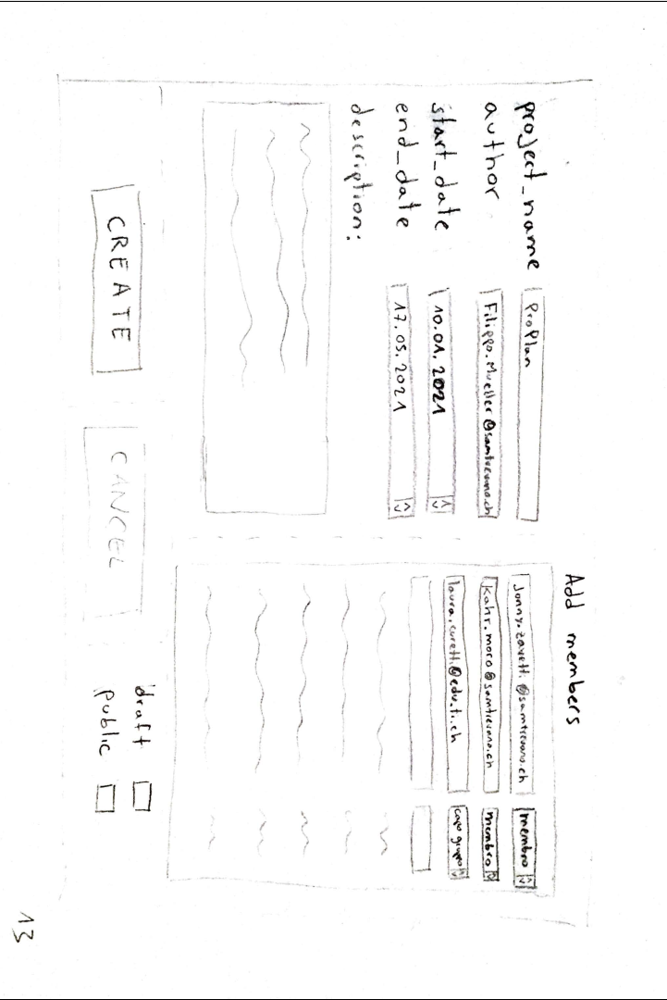
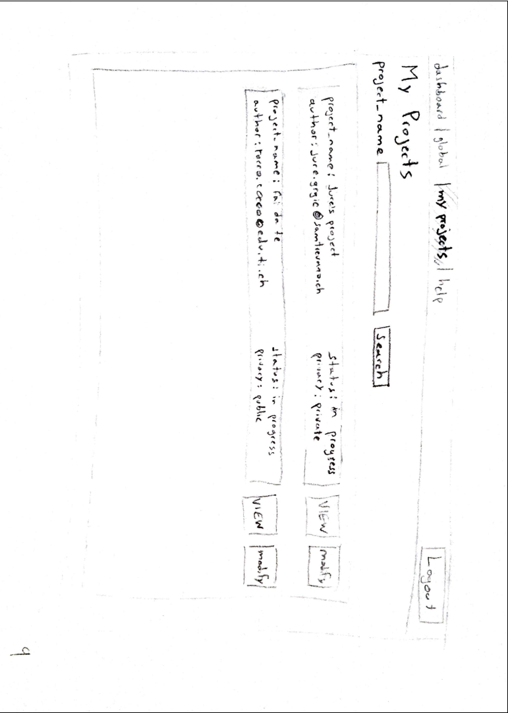
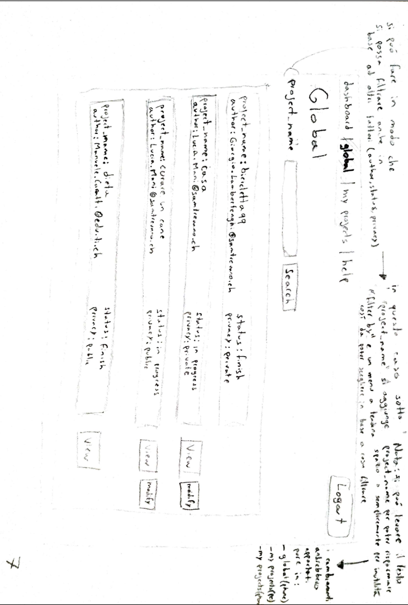
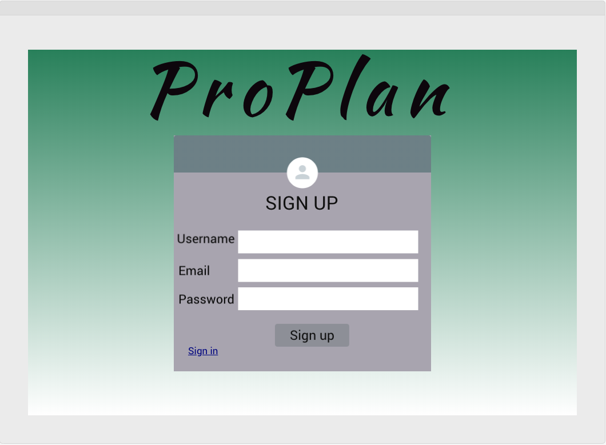
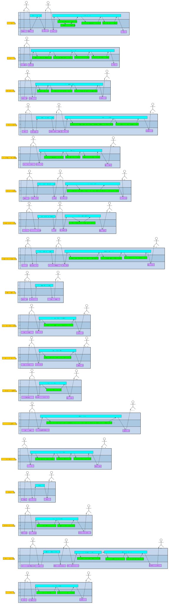
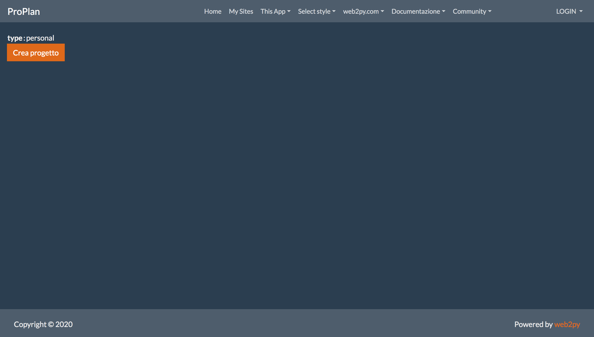
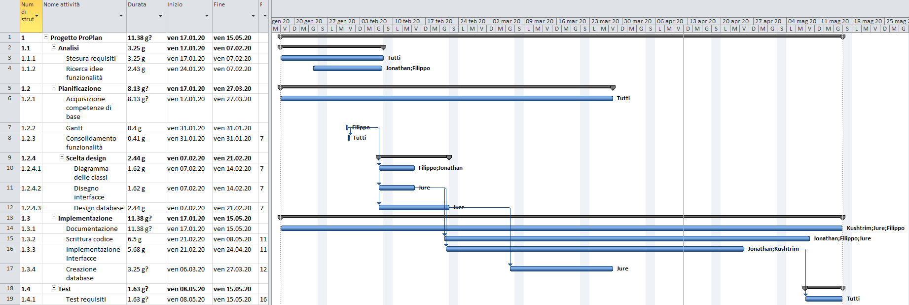

# Sommario
1. [Introduzione](#introduzione)
    - [Informazioni sul progetto](#informazioni-sul-progetto)
    - [Abstract](#abstract)
    - [Scopo](#scopo)
1. [Analisi](#analisi)
    - [Analisi del dominio](#analisi-del-dominio)
    - [Analisi dei mezzi](#analisi-dei-mezzi)
    - [Analisi e specifica dei requisiti](#analisi-e-specifica-dei-requisiti)
    - [Use case](#use-case)
    - [Pianificazione](#pianificazione)
1. [Progettazione](#progettazione)
    - [Design dell’architettura del sistema](#design-dell’architettura-del-sistema)
    - [Design dei dati e database](#design-dei-dati-e-database)
1. [Implementazione](#implementazione)
1. [Test](#test)
    - [Protocollo di test](#protocollo-di-test)
    - [Risultati test](#risultati-test)
    - [Mancanze/limitazioni conosciute](#mancanze/limitazioni-conosciute)
1. [Consuntivo](#consuntivo)
1. [Conclusioni](#conclusioni)
    - [Sviluppi futuri](#sviluppi-futuri)
    - [Considerazioni personali](#considerazioni-personali)
1. [Sitografia](#sitografia)
1. [Allegati](#allegati)

 

# Introduzione
## Informazioni sul progetto
**Nome: ProPlan**
- Allievi: Kushtrim Rushi, Filippo Zinetti, Jure Grgic, Jonathan Müller
- Docente responsabile al controllo del lavoro: Luca Muggiasca
- Data inizio del progetto: 17 Gennaio 2020
- Data fine del progetto: 15 Maggio 2020
- Luogo di lavoro: Scuola arti e mestieri di Trevano, Canobbio
- Sezione scolastica: 3° anno d'informatica
- Materia: modulo 306 (Realizzare un progetto IT)

## Abstract
Migliaia sono i progetti che ogni giorno vengono avviati. Hanno diverse dimensioni, diversi scopi e finscono in diversi modi, ma quello che hanno in comune è una delle fasi cruciali, che deve essere svolta all'inizio indipendentemente da tutto: la progettazione.
Questa comprende una scomposizione del lavoro in fasi più piccole e più gestibili da singole persone o team, che devono poi collaborare al meglio per raggiungere un obbiettivo comune. Questo non dovrebbe essere un problema, poichè esistono molte soluzioni per gestire team di persone... quello che manca a questi è **semplicità** e **immediatezza** nel loro utilizzo.
È per questo che abbiamo sviluppato ProPlan, uno strumento che permette di creare e gestire piccoli progetti in modo immediato e senza quindi perdersi in impostazioni e funzionalità superflue.
La piattaforma è sviluppata in python, linguaggio sempre più popolare grazie alla sua semplicità, che rispecchia quindi perfettamente gli ideali del progetto.

 

## Scopo
Il progetto ci è stato assegnato dalla scuola ed è quindi un progetto didattico, ma potrà poi risultare utile anche a coloro che necessiteranno di gestire un progetto di gruppo nei prossimi anni.
L'obbettivo è quello di creare uno strumento simile ad alcuni già esistenti, ma con funzionalità meno dispersive in modo da risultare più semplice per gli utilizzatori. Le soluzioni attuali presentano infatti diversi elementi superflui per il target di ProPlan, di cui anche gli sviluppatori hanno fanno parte, ed è quindi sull'analisi dei bisogni e degli elementi di disturbo che la piattaforma è sviluppata.
L'applicativo sarà reso disponibile tramite pagina web, quindi raggiungibile da ovunque tramite l'apposito dominio.
Quello che si vuole raggiungere è una via di mezzo tra applicativi come Trello e Microsoft Project, integrando le funzionalità principali di entrambi ma tralasciando quelle meno utilizzate.

 

# Analisi
## Analisi del dominio
ProPlan è progettato per l'uso nell'ambiente scolastico della SAMT, andando a sostituire altri programmi (es: trello, eventualmente Microsoft Project e Project Libre). Il software dovrà risiedere da qualche parte nella rete della scuola o quantomeno accessibile da questa, e dovrà quindi far fronte al proxy che blocca parte delle comunicazioni. Lo sviluppo avverrà su una piattaforma apposita di hosting online [pyhtonanywhere](https://www.pythonanywhere.com/).
Gli utilizzatori saranno allievi ed eventualmente docenti mandanti della SAMT (scuola arti e mestieri di Trevano), che necessitano rispettivamente di imparare e di valutare la gestione dei progetti.
La conoscenza richiesta, oltre al saper utilizzare un computer per interagire con la pagina vera e propria, è quella di una base delle modalità di gestione di un progetto per poter amministrare l'incarico e un minimo di propensione nel lavoro in team.

## Analisi e specifica dei requisiti

|**ID**|**Nome**        |**Priorità**|**Vers**|**Note**|
|------|----------------|------------|--------|--------|
|Req-01|Realizzare un sito web per la gesitone dei progetti|1|1.0|...|
|Req-02|Il sito web è programmato in python|1|1.0|...|
|Req-03|Ci deve essere una schermata di signup e una di login|1|1.0|...|
|Req-04|Ci deve essere una schermata di password recovery|3|1.0|...|
|Req-05|Ci sono due tipi di utente a livello del login (admin, utente)|1|1.0|...|
|Req-06|Ci deve essere una schermata principale con la lista dei progetti|2|1.0|...|
|Req-07|Si può creare un progetto|1|1.0|...|
|Req-08|Un progetto deve avere dei dettagli (nome, descrizione, lista membri, inizio e fine)|1|1.0|...|
|Req-09|Un progetto può essere una bozza o un progetto finale|1|1.0|...|
|Req-10|Una bozza si può convertire in un progetto finale|2|1.0|...|
|Req-11|Un progetto può essere pubblico o privato (non visibile da non-membri)|1|1.0|...|
|Req-12|Gli utenti hanno ruoli diversi a livello di progetto (capoprogetto, ospite, …)|1|1.0|...|
|Req-13|Nel progetto si possono creare delle attività|1|1.0|...|
|Req-14|Si possono modificare le informazioni di un progetto|2|1.0|...|
|Req-15|Una attività deve avere dei dettagli (nome, descrizione, durata)|1|1.0|...|
|Req-16|Un'attività può essere in determinate sezioni (idea, da fare, in esecuzione, terminato, testato, approvato)|1|1.0|...|
|Req-17|Si possono creare nuove sezioni|1|1.0|...|
|Req-18|Ci deve essere una sezione dove si può reportare i bug|2|1.0|...|
|Req-19|Vanno controllati gli indirizzi email per registrarsi|2|1.0|consentito solo per @samtrevano.ch — @edu.ti.ch|
|Req-20|Ci deve essere un database per il salvataggio dei progetti|1|1.0|...|
|Req-21|Si possono utilizzare le attività di un progetto concluso come nuove attività|4|1.0|!!!|

 

## Use case

## Pianificazione
Gantt preventivo:

Il lavoro durerà 5 mesi, da gennaio a maggio. Abbiamo pianificato un mese di studio (fino a inizio febbraio), due settimane di design, circa 3 mesi di implementazione e infine due settimane di test e rifinimenti vari. Inoltre, per un mese dall'inizio del progetto dovremo inoltre dedicare parte del tempo ad imparare gli strumenti da utilizzare.

 

## Analisi dei mezzi

### Linguaggio
L'applicativo si basa su python, un linguaggio di alto livello disponibile su ogni piattaforma e che si distingue per la sua sintassi severa rispetto all'indentazione, a favore di una scrittura spesso più breve.

### Framework
Per lo sviluppo è stato utilizzato Web2py, un framework leggero e pensato per creare piccole applicazioni web. Inoltre, integra SQLite, le librerie necessarie per interagirci ed eventualmente la possiblità di espandere il database (passando, per esempio, ad Oracle o mySQL) senza problemi grazie all'alto livello di astrazione.

### Hosting
L'ambiente di sviluppo sarà la piattaforma di hosting pythonanywhere, quindi l'hardware è rappresentato da computer portatili che integreranno il server grazie a web2py e dei client simulati tramite browser.
La piattaforma di funzionamento è vincolata non a sistemi operativi specifici, quanto più ai browser che andranno a visitare le pagine del sito, i quali dovranno essere abbastanza recenti ed aggiornati da supportare le funzioni del software.

### Altre librerie

#### Highcharts - Libreria javascript
Per realzzare i diagrammi di gantt abbiamo utilizzato la libreria messa a disposizione da [Highcharts](https://www.highcharts.com/): questa libreria permette la creazione di diversi tipi di grafici convertendoli da codice JSON.

 

# Progettazione

## Design dell’architettura del sistema

### Struttura delle cartelle
Per avere in chiaro dove lavorare e per trovare un accordo sulla struttura dei link, abbiamo definito la [struttura delle cartelle](../Progettazione/strutturaCartelle.md) da usare per il sito.

### Base del funzionamento
Il pattern utilizzato da web2py è un MVC (Model, View, Controller) piuttosto standard.

#### Models
Qui va definita la struttura del database, basata su SQLite. A differenza dei comuni MVC in, ad esempio, PHP, i models contengono codice eseguito all'avvio dell'applicazione, ma non metodi richiamabile svolgono quindi una funzione meno attiva per la programmazione.

Non prevediamo altri scambi di dati.

#### Controllers
I controller sono il punto principale di gestione delle funzionalità dell'applicativo. Comunicano con i models e preparano le views, prendendo, gestendo e trasferendo i dati tra schemi di database e views. Ogni metodo corrisponde al nome di una view, e i valori di ritorno saranno poi utilizzabili da queste.

#### Views
Questi file contengono principalmente codice HTML, oltre che CSS e JavaScript per lo stile. Sono arricchite però da wildcards definite da web2py e usabili con la normale sintassi di python che fanno da "placeholders" per variabili prese dai controller.

Come per ogni tipico MVC, ogni view è contenuta in una cartella che corrisponde al nome di un controller.

### Use case

La base della nostra progettazione è questo diagramma, che rappresenta in stile use case le interazioni possibili e gli indirizzamenti conseguenti dell'applicazione. Non è propriamente uno schema dei casi d'uso, poichè abbiamo definito regole riconosciute solo all'interno del team di lavoro e visibili nella legenda allegata al diagramma.

Il suo scopo è rappresentare in forma schematica le schermate e pulsanti disponibili, ma senza scendere nei dettagli della parte visiva.

La prima pagina che appare navigando all'indirizzo del progetto è una schermata di login. Tutti gli altri eventuali argomenti aggiungi dopo l'URL del progetto riportano comunque al login e vengono eliminati dalla barra degli indirizzi. Da qui è possibile accedere al sito se si dispone già di un account, oppure si può passare alla schermata di sing up per registrarsi.
Una volta eseguito l'accesso, una pagina "home" permetterà di vedere solo alcuni tra i progetti già esistenti, sia personali che pubblici, con anche la possibilità di accedervi se si fa parte del progetto. È anche possibile visualizzare una lista completa in un altra pagina. In entrambe sarà possibile creare un nuovo progetto. Per farlo, un pop up contenente un form permetterà di deciderne alcuni parametri.
Alla creazione o all'accesso ad un progetto, la pagina principale mostrerà una lista orizzontale delle attività presenti, divise per categoria. Qui, le azioni disponibili sono visualizzare, modificare e creare le attività, gestire i membri del progetto o passare alla visualizzazione gantt grazie alla quale si potrà avere una visione più immediata del lavoro. Oltre a questo, sarà anche possibile, grazie ad un form che utilizza ajax, gestire le attività senza il bisogno di aggiornare la pagina: sia i campi di input che il grafico vero e proprio saranno subito aggiornati.

## Design dei dati e database

### Schema E-R, schema logico e descrizione.

## Design delle interfacce

### Progetti iniziali
Abbiamo cominciato disegnando alcune schermate in modo da renderci conto di quali elementi avremmo avuto bisogno. Non sono state scelte di comune accordo, quindi risultano diverse dal risultato finale.

In seguito abbiamo anche provato a disegnare delle schermate con programmi appositi, ma non eravamo in chiaro sugli strumenti che avremmo avuto a disposizione per crearle, quindi anche queste si differenziano dal design definitivo.

## Design procedurale

Il diagramma UML spiega in modo più dettagliato la logica descrivendo i nomi dei metodi e il loro livello nella struttura MVC (model, view, controller)

 

# Implementazione

## Struttura del sito

### Models
Nel models, che è la porta logica del MVC, è la parte dove abbiamo definito un database con tutte le tabelle di cui necessitavamo. 
Ecco la lista delle tabelle che abbiamo utilizzato per questo progetto:
  - db.auth_user
  - db.project
  - db.project_user
  - db.tast_group
  - db.tast
  - db.draft_project
  - db.final_project
  - db.user_task
[Qui](#design-dei-dati-e-database) potrete vedere com'è strutturato il nostro database e le relazioni tra le varie tabelle.
Nel models oltre a specificare le caratteristiche del database, eseguiamo anche un controllo sui dati che vengono inseriti nella tabella db.auth_user, più precisamente sull'email con cui gli utenti si registrano e sulle password che vengono utilizzate.

### Controllers
Nel controllers, che è la parte che fa da intermediario tra il models e le views, troviamo tutti i metodi che rendono appunto possibile la comunicazione tra una view e un model. I due controller più importanti sono quello per il sistema di autenticazione utente (login, register, logout, retrieve_password, ...) e quello per il reindirizzamento all'index principale del sito web. Sono presenti anche ovviamente i controller per il reindirizzamento alle altre pagine presenti nel sito, ovvero per i progetti personali e i progetti globali, senza dimenticare anche della pagina per le FAQs

### Views
Nel Views, che è la parte visiva del MVC, sono presenti tutte le pagine .html che utilizzamo per il nostro sito. Le nostre pagine .html sono quelle elencate qui in seguito:
 - default/index.html (pagina dell'index principale)
 - default/user.html (permette di visualizzare tutte le pagine per l'autenticazione utente o correlati)
 - default/help.html (pagina dove si trovano le FAQs)
 - projectlist/index.html (pagina dei progetti globali)
 - projectlist/createProject.html (pagina dov'è presente il form per creare un nuovo progetto)
 - project/ganttView.html (pagina della parte del gantt quando si è all'interno di un progetto)
 - project/index.html (pagina di gestione di un progetto)

## Design delle interfacce
I design delle interfacce che avevamo progettato, sono molto differenti da come le abbiamo sviluppate. Solo due interfacce rispoecchiano la nostra progettazione, e sono la dashboard iniziale del sito, e la pagina di autenticazione utente. I colori differiscono un po' nella pagina di autenticazione utente, ma la struttura è la stessa.
Per le pagine dei progetti globali e i progetti personali invece è tutto diverso, non è minimamente simile alla progettazione. Questo è causato dalle difficoltà riscontrate durante lo sviluppo e dalla nostra mancanza di conoscenza riguardo la struttura di web2py.

In seguito potete vedere le pagine da noi sviluppate riguardo i progetti globali e quelli personali

*NOTA: le due pagine per i progetti globali e per i progetti personali, sono state progettate in modo uguale o molto simili*

- Differenza #1: Lo stile dei vari progetti che vengono mostrati in schermata, ovvero, avevamo progettato di fare ogni progetto che si estendesse su tutto il piano orizzontale e che contenesse il nome del progetto, il nome dell'autore del progetto, lo stato del progetto e la privacy (pubblico o privato). Invece l'abbiamo implementato in un modo diverso, i progetti non si estendono sul piano orizzontale, ma sono come delle carte (a forma rettangolare) e mostra solo il nome del progetto con una piccola descrizione.
- Differenza #2: Era stato pianificato di rendere utilizzabile un sistema di ricerca dei progetti, cosicchè nel caso ci fossero molti progetti, la ricerca di un progetto sia più facile e agevole. Questa funzione però non è stata implementata.
- Differenza #3: Avevamo deciso di mettere uno o due pulsanti (a dipendenza del tipo di privacy) che avevano il ruolo di permettere di modificare un progetto o anche solo poterlo vedere, senza poter modificare. Però anche questo particolare è stato implementano a metà circa, perchè esiste un solo un pulsante che permette di entrare e modificare il progetto (ovviamente solo a chi ha il permesso di farlo).

## Logica del sito / design procedurale *nome temporaneo*
La logica del funzionamento del sito non è stata sviluppata al 100% come era stato progettato, ma buona parte della progettazione è stata implementata com'era programmato. Tutta la logica di autenticazione utente era già presente grazie a web2py, ma questo non ha fatto differenza dalla nostra progettazione. ...

## Use cases
Questa parte della progettazione è risultata affidabile e ha fornito un'utile guida per darci un idea su cosa fare. È stato rispettato, ma abbiamo dovuto tralasciare la parte di reset della password dell'account per mancanza di tempo per studiare, valutare e implementare le risorse necessarie (creare e configurare un mail server, o trovare un servizio che invii mail utilizzabile da uno script, definire tutta la parte di gestione dello scambio di dati sensibili,...).

## UML
Durante l'implementazione, ci siamo resi conto che non tutti i nostri progetti avrebbero potuto essere applicati. Per esempio, il diagramma UML non ha potuto funzionare con il metodo basato più che altro su controller e view, nel quale i model vengono solo "istanziati" all'inizio e non più trattati direttamente poichè i dati (in questo caso quelli del database) sono utilizzabili da ogni controller senza ulteriori riferimenti.

 

# Test

## Protocollo di test

|*Test Case*|*TC-01*|
|-----------|-------|
|Nome|Sito web|
|Riferimento|Req-01|
|Descrizione|Deve esistere un sito web funzionante che permette di gestire i progetti|
|Prerequisiti||
|Procedura|Andare sul sito internet https://proplansamt2020.pythonanywhere.com/ProPlan |
|Risultati attesi|Si troverà la pagina di login |

|*Test Case*|*TC-02*|
|-----------|-------|
|Nome|Signup, Login|
|Riferimento|Req-03|
|Descrizione|Il sito deve permettere ad un utente di registrarsi o loggarsi all'interno del sito, per entrare nel sito serve una email e una password|
|Prerequisiti||
|Procedura|Una volta entrati nel sito questo ti reindizerrà nella pagina di login dalla quale si potrà accedere se si ha già un account. Se non si ha l'accaunt bisogna registrarsi, per fare ciò si può premere il tasto di signup nella pagina di login e si posso inserire i vari dati.|
|Risultati attesi|Alla fine di tutto si dovra essere alla pagine principale del sito "/default/index"|

|*Test Case*|*TC-03*|
|-----------|-------|
|Nome|Password recovery|
|Riferimento|Req-04|
|Descrizione|Deve essere possibile poter cambiare password in caso che si sia dimenticata o in caso che untento voglia di sua spontanea volontà di cambiare password|
|Prerequisiti|Serve un account e conoscere la mail|
|Procedura|In caso si sia dimenticato nella pagina di login c'è un link che porta alla pagina di password recovery, una volta arrivati qui basta inserire la propria mail e arrivare nella mail box della persona una mail con un codice, inserire il codice nel sito e poi si potrà cambiare password, invece se una persona vuole cambiare la propria mail in alto a destra ci sono le informazione dell'utente, c'è un bottone che permette di andare nella nella password recovery e eseguire lo stesso passaggio di prima|
|Risultati attesi|Al loggin deve essere possibile loggarsi con la password cambiata e non con la vecchia password|

|*Test Case*|*TC-04*|
|-----------|-------|
|Nome|Lista progetti|
|Riferimento|Req-06|
|Descrizione|Ci deve essere una pagina nel sito in cui c'è la lista dei propri progetti|
|Prerequisiti|Si deve essere loggati|
|Procedura|Dopo il login nella pagina principale del sito c'è una categoria "Personali", bisogna cliccarci sopra e comparirà un drop down, nel drop down c'è un link alla lista di progetti|
|Risultati attesi|Una volta finito si deve essere nella pagina dove ci sono tutti i progetti a cui si fa parte, la pagina è "/projectlist/index"|

|*Test Case*|*TC-05*|
|-----------|-------|
|Nome|Creazione progetto|
|Riferimento|Req-07|
|Descrizione|Si può creare un nuovo progetto, così poi ci si puoi lavorare|
|Prerequisiti|Si deve essere loggati|
|Procedura|Nella pagina di "/projectlist/index" c'è il bottone "Crea progetto" dove una volta inserito i dati neccesari con il pulsante "Crea" si crea il nuovo progetto|
|Risultati attesi|Una volta fatto "Crea" nella lista dei progetti dovrebbe apparire il nuovo progetto con i dati che si sono definiti alla creazione|

|*Test Case*|*TC-06*|
|-----------|-------|
|Nome|Evuluzione di una bozza|
|Riferimento|Req-10|
|Descrizione|Dato che un progetto può essere una bozza (nel progetto bozza si possono solo mettere idee) o un progetto finale (nel progetto finale è possibile inserire più dati: data_inizio, data_fine, team, …), una volta che si è scelta una bozza si può fare un upgrade del progetto e renderlo finale così da definire un team e le date di inizio e fine.|
|Prerequisiti|Si deve avere un progetto di tipo bozza|
|Procedura|All'interno della pagina del singolo progetto (in caso questo sia una bozza) c'è un bottone "Upgrade", per far diventare una bozza in finale bisogna cliccare il bottone|
|Risultati attesi|Il risultato deve essere un progetto finale dove è possibile inserire data inizio, fine e inserire il team di lavoro|

|*Test Case*|*TC-07*|
|-----------|-------|
|Nome|Progetto publicco o privato|
|Riferimento|Req-11|
|Descrizione|Un progetto può essere pubblico (visibile a tutte le persone) o privato (visibile alle persone che fan parte del team di progetto), e si deve poter scegliere se il progetto sia uno o l'altro|
|Prerequisiti||
|Procedura|Alla creazione di un progetto si può definire se il progetto è pubblico o privato (in caso che questo solo se il progetto è finale). Invece in caso che è una bozza all'upgrade del progetto si può definire se il progetto diventerà pubblico o finale|
|Risultati attesi|Se un progetto è privato o una bozza viene mostrato solo ai membri del progetto sotto a progetti personali|

|*Test Case*|*TC-08*|
|-----------|-------|
|Nome|Creazione attività|
|Riferimento|Req-13|
|Descrizione|In un progetto si può creare un attività che un persona del team dovrà svolgere per il compimento del progetto|
|Prerequisiti|Si deve avere un progetto con le sezioni di default oppure creare una sezione|
|Procedura|Nella pagina di progetto sotto a ogni sezoine c'è un bottone "Crea attività" dove una volta cliccato è possibile definire una attività che verà collocata nella sezione in cui si è cliccato il bottone|
|Risultati attesi|Una volta creato l'attività si dovrebbe vedre la stessa attività nella sezione selezionata|

|*Test Case*|*TC-09*|
|-----------|-------|
|Nome|Creazione di sezione|
|Riferimento|Req-17|
|Descrizione|Ci sono le sezione di default (per chi vuole), ma in caso che serve aggiungere più sezioni un utente può farlo, così da poter mettere le attività di propria creazione|
|Prerequisiti|Si deve avere un progetto|
|Procedura|Nella pagina di progetto dopo le sezione c'è un bottone che permette di creare una nuova sezione definità da nome|
|Risultati attesi|Una volta inserita una nuova sezione dovrebbe vedersi aparrire questa nella pagine di progetto e si potrebbe aggiungere un'attività in questa sezione|

|*Test Case*|*TC-10*|
|-----------|-------|
|Nome|Spostamento attività|
|Riferimento|Req-16|
|Descrizione|Si può fare in modo di spostare una attività da una sezione ad un'altra|
|Prerequisiti|Si deve avere un progetto e almeno due sezioni|
|Procedura|Nella pagina di rpogetto si vedono tutte le attività basta cliccare l'attivatà e usciranno tutte le sue informazioni e basterà cambiare il riferimento della sezione|
|Risultati attesi|Si dovrà vedere l'attività nella nuova sezione e non in quella vecchia (da dove si è spostato)|

|*Test Case*|*TC-11*|
|-----------|-------|
|Nome|Email corretti|
|Riferimento|Req-19|
|Descrizione|Dato che il progetto è scolastico, è possibile collegarsi solo con account della scuola ovvero per gli allievi "@samtrevano.ch" mentre per i professori "@edu.ti.ch"|
|Prerequisiti||
|Procedura|Nel signup quando si inserisce un nuvo utento viene effettuato il controllo della mail in caso la mail non è ne di un alievo e neanche di professore allora non viene inserito nel database, mentre se la mail è valida questa viene inserito nel database|
|Risultati attesi|In caso la mail non è valida esce un errore, invece in caso che la mail è valida esce la scritta "Success"|

<!--
|Test Case      | TC-00                               |
|---------------|--------------------------------------|
|**Nome**       | |
|**Riferimento**|REQ-00                               |
|**Descrizione**| |
|**Prerequisiti**| |
|**Procedura**     |  |
|**Risultati attesi** | |

|Test Case      | TC-00                               |
|---------------|--------------------------------------|
|**Nome**       | |
|**Riferimento**|REQ-00                               |
|**Descrizione**| |
|**Prerequisiti**| |
|**Procedura**     |  |
|**Risultati attesi** | |

|Test Case      | TC-001                               |
|---------------|--------------------------------------|
|**Nome**       |Import a card, but not shown with the GUI |
|**Riferimento**|REQ-012                               |
|**Descrizione**|Import a card with KIC, KID and KIK keys with no obfuscation, but not shown with the GUI |
|**Prerequisiti**|Store on local PC: Profile\_1.2.001.xml (appendix n\_n) and Cards\_1.2.001.txt (appendix n\_n) |
|**Procedura**     | - Go to “Cards manager” menu, in main page click “Import Profiles” link, Select the “1.2.001.xml” file, Import the Profile - Go to “Cards manager” menu, in main page click “Import Cards” link, Select the “1.2.001.txt” file, Delete the cards, Select the “1.2.001.txt” file, Import the cards |
|**Risultati attesi** |Keys visible in the DB (OtaCardKey) but not visible in the GUI (Card details) |
-->

## Risultati test

<!--
Tabella riassuntiva in cui si inseriscono i test riusciti e non del
prodotto finale. Se un test non riesce e viene corretto l’errore, questo
dovrà risultare nel documento finale come riuscito (la procedura della
correzione apparirà nel diario), altrimenti dovrà essere descritto
l’errore con eventuali ipotesi di correzione.
-->
## Mancanze/limitazioni conosciute

### Autenticazione tramite email
Una volta inserita una password valida e una password, l'account è registrato e quella mail non è più utilizzabile da nessun altro: questo può portare a sgradevoli situazioni di account "rubati". Bisognerebbe inviare una mail con un codice di conferma da inserire in un altro form per essere sicuri che chi sta creando l'account è il vero proprietario di quella mail, ma per questo sarebbe necessario creare e configurare un mail server apposito.

### Password recovery
Non è possibile resettare la password in caso di perdita ma, anche qui, serve un mail server.

### Stile
Lo stile del sito, in alcune determinate situazioni, non è ottimale e andrebbe rifinito .

### Differenti utenti
I permessi dei vari utenti sono sempre gli stessi, poichè manca la parte logica di gestione delle azioni disponibili, che sarebbe necessaria nonostante la nostra "politica" di semplicità generale

 

# Consuntivo
Gantt consuntivo:

La pianificazione è rimasta abbastanza fedele all'originale. Gli unici cambiamenti sono avvenuti a causa di un cambio di strategia (quasi in contemporanea al completamento del gantt, abbiamo optato per un'applicazione web al posto di una offline con anche un server dedicato dietro, quindi un'intera attività principale è stata tolta) e, anche se non ha cambiato il programma ma l'ha solo accorciato, l'anticipazione della consegna di 2 settimane.

 

# Conclusioni

<!--
Quali sono le implicazioni della mia soluzione? Che impatto avrà?
Cambierà il mondo? È un successo importante? È solo un’aggiunta
marginale o è semplicemente servita per scoprire che questo percorso è
stato una perdita di tempo? I risultati ottenuti sono generali,
facilmente generalizzabili o sono specifici di un caso particolare? ecc
-->
## Sviluppi futuri

### Supporto multilingua
Web2py include un dizionario per la corrispondenza delle parole nelle varie lingue, quindi bisognerebbe sostituire tutto il testo "hard coded" con queste parole "universali", magari in inglese per chiarezza e coerenza con il resto dell'applicazione.

## Aggiunta attività
Attualmente l'aggiunta delle attività si differenzia tra gantt e visualizzazione normale: nel primo avviene dinamicamente senza aggiornare la pagina, nel secondo no.

### Conversione JSON-gantt
È possibile, in python, leggere e scrivere file .mpp (microsoft project). Attualmente, il gantt è in json e salvabile al massimo come CSV grazie ad Highcharts, ma sarebbe interessante poterlo eventualmente scaricare (o anche caricare) nel formato più comune per questi tipi di grafici cioè, appunto, .mpp.

<!--Migliorie o estensioni che possono essere sviluppate sul prodotto.
-->
## Considerazioni personali
-   Jure: "Lavorare in gruppo è stato più complicato del previsto, però alla fine mi sono adattato e ho provato ad essere più efficace per poter lavorare in sincronia con il gruppo. È stato un progetto anch'esso più difficile del previsto, ma è stato un progetto interessante da implementare. ...altro"
-   Filippo:
-   Kushtrim:
-   Jonathan:

## Sitografia

-   https://proplansamt2020.pythonanywhere.com/ProPlan/default/index, 
    *ProPlan*, 06-05-2020.

# Allegati

- [Diario 24/01/2020](./Diari/KUSRUS_JONMUE_JURGRG_FILZIN_PROPLAN_2020-01-24.md)
- [Diario 31/01/2020](./Diari/KUSRUS_JONMUE_JURGRG_FILZIN_PROPLAN_2020-01-31.md)
- [Diario 07/02/2020](./Diari/KUSRUS_JONMUE_JURGRG_FILZIN_PROPLAN_2020-02-07.md)
- [Diario 14/02/2020](./Diari/KUSRUS_JONMUE_JURGRG_FILZIN_PROPLAN_2020-02-14.md)
- [Diario 21/02/2020](./Diari/KUSRUS_JONMUE_JURGRG_FILZIN_PROPLAN_2020-02-21.md)
- [Diario 06/03/2020](./Diari/KUSRUS_JONMUE_JURGRG_FILZIN_PROPLAN_2020-03-06.md)
- [Diario 13/03/2020](./Diari/KUSRUS_JONMUE_JURGRG_FILZIN_PROPLAN_2020-03-13.md)
- [Diario 27/03/2020](./Diari/KUSRUS_JONMUE_JURGRG_FILZIN_PROPLAN_2020-03-27.md)
- [Diario 03/04/2020](./Diari/KUSRUS_JONMUE_JURGRG_FILZIN_PROPLAN_2020-04-03.md)
- [Diario 24/04/2020](./Diari/KUSRUS_JONMUE_JURGRG_FILZIN_PROPLAN_2020-04-24.md)

<object data="../Progettazione/mandato.pdf" type="application/pdf">
    <embed src="../Progettazione/mandato.pdf">
        
<a href="../Progettazione/mandato.pdf">Qui</a> si può visualizzare il mandato

    </embed>
</object>

    Il pacchetto del codice sorgente si può trovare nella home di github del progetto ProPlan, e possiede il nome web2py.app.ProPlan.w2p ([Clicca qui](https://github.com/LuMug/ProPlan)).

Come accedere al sito:

 - Opzione 1: Utilizzare il link che si trova nel capitolo della sitografia ([Clicca qui](#sitografia)), e in seguito registrarsi presso il sito utilizzando una mail consona alle credenziali (@samtrevano.ch o @edu.ti.ch). Una volta che si ha eseguito la registrazione, si può fare il login ed usufruire al nostro servizio.
 - Opzione 2: Nella nostra home di 
